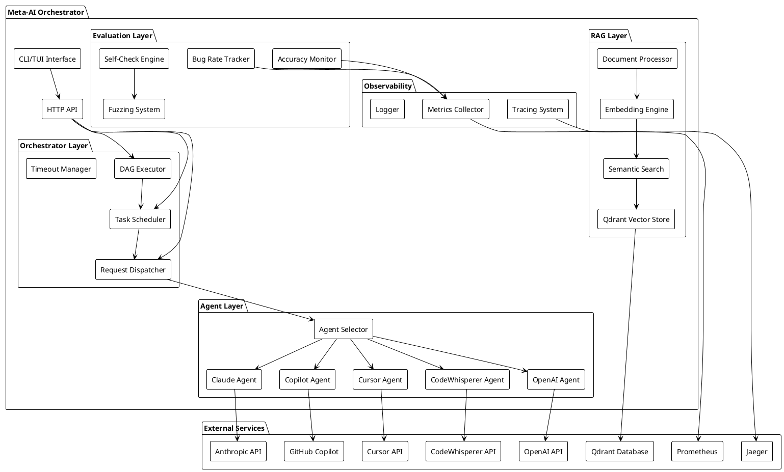
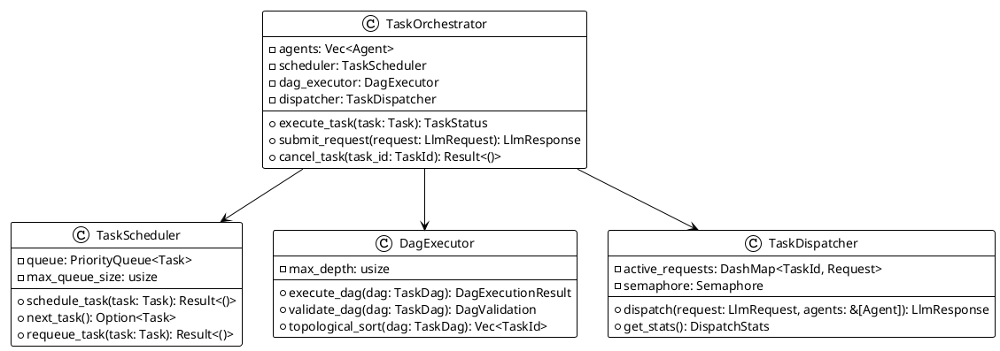
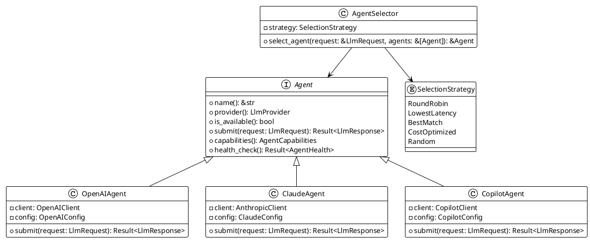
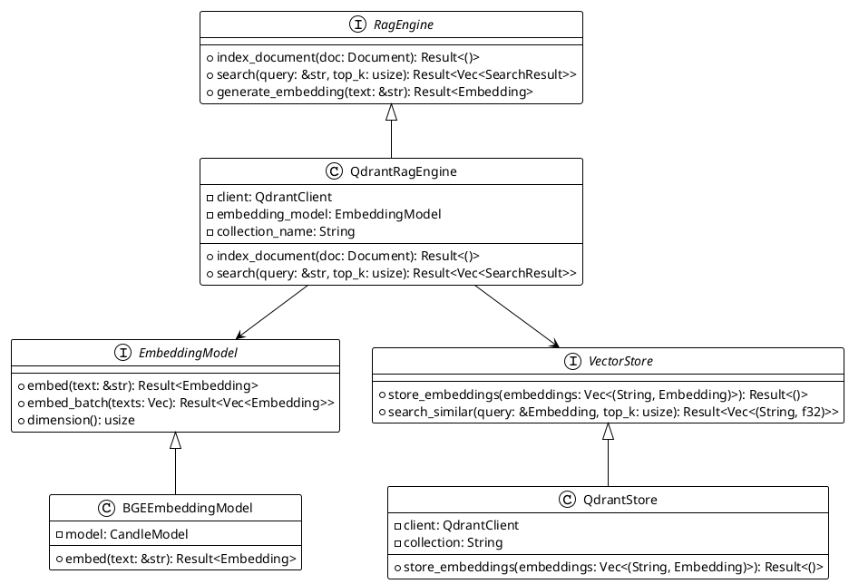
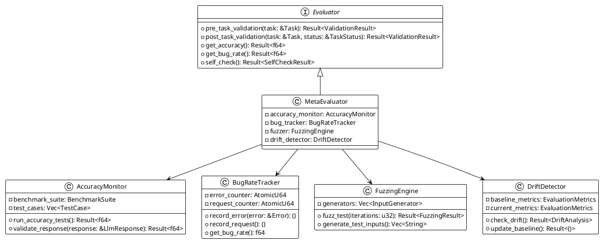
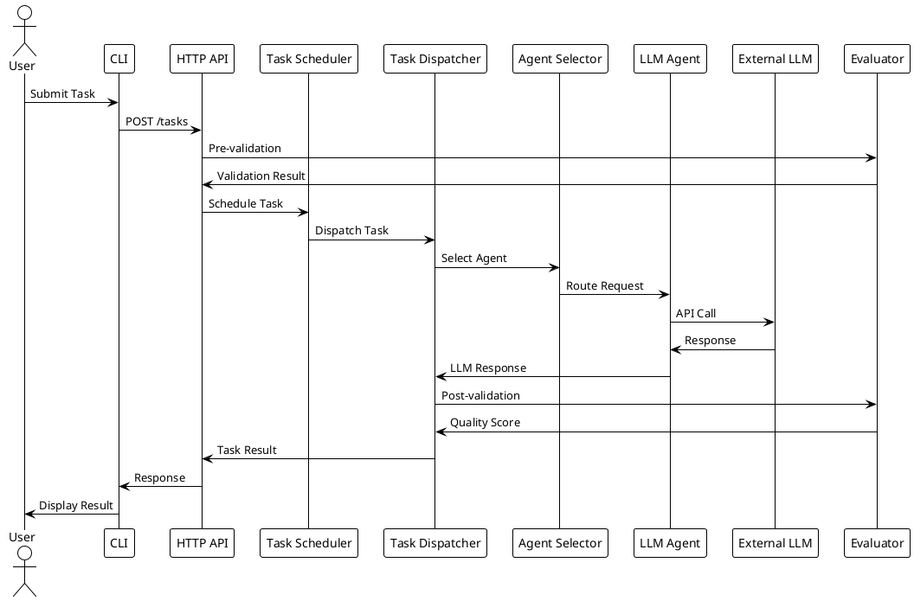
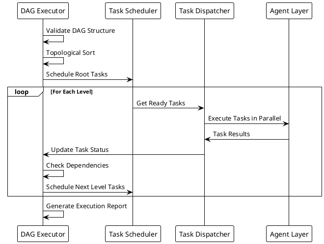
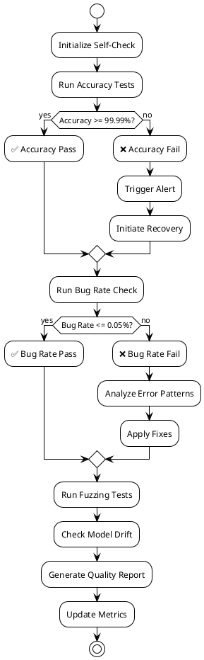
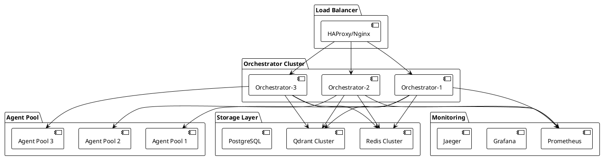

# System Architecture Overview

## High-Level Architecture

## Core Components

### 1. Orchestrator Layer

The orchestrator layer manages task execution, scheduling, and coordination:

### 2. Agent Layer

Multi-provider LLM integration with intelligent routing:

### 3. RAG Layer

Retrieval-Augmented Generation with vector search:

### 4. Evaluation Layer

Quality assurance and monitoring:

## Data Flow

### Request Processing Flow

### DAG Execution Flow

## Quality Assurance Architecture

### Self-Check Cycle

## Scalability Design

### Horizontal Scaling

This architecture ensures:
- **High Availability**: Multi-instance deployment with load balancing
- **Scalability**: Horizontal scaling of orchestrator instances
- **Fault Tolerance**: Circuit breakers and retry mechanisms
- **Performance**: Async processing and connection pooling
- **Observability**: Comprehensive monitoring and tracing